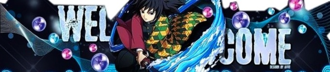

# Hello World!, I'm Martin, a Kenyan Developer 👋🏼:
Currently Working on my final year project👨🏼‍🎓 Studying computer science at Kisii University<br>👨🏼‍💻Welcome to my GitHub profile! Feel free to explore my projects and contributions.<br> I'm currently learning **Framer** to build interactive and responsive websites. Excited to share my progress soon!

<picture>
  <source media="(prefers-color-scheme: dark)" srcset="https://raw.githubusercontent.com/lemonhead-ai/lemonhead-ai/output/github-snake-dark.svg" />
  <source media="(prefers-color-scheme: light)" srcset="https://raw.githubusercontent.com/lemonhead-ai/lemonhead-ai/output/github-snake.svg" />
  
</picture>

<h2>🚀 Tech Stack 🛠️</h2>
<p><a target="_blank" href="https://www.vectorlogo.zone/logos/dartlang/dartlang-icon.svg" style="display: inline-block;"></a>
<a target="_blank" href="https://www.vectorlogo.zone/logos/framer/framer-icon.svg" style="display: inline-block;"></a>
<a target="_blank" href="https://raw.githubusercontent.com/devicons/devicon/master/icons/python/python-original.svg" style="display: inline-block;"></a>
<a target="_blank" href="https://raw.githubusercontent.com/devicons/devicon/master/icons/mysql/mysql-original-wordmark.svg" style="display: inline-block;"></a>
<a target="_blank" href="https://www.vectorlogo.zone/logos/firebase/firebase-icon.svg" style="display: inline-block;"></a>
<a target="_blank" href="https://raw.githubusercontent.com/devicons/devicon/master/icons/java/java-original.svg" style="display: inline-block;"></a>
<a target="_blank" href="https://www.vectorlogo.zone/logos/flutterio/flutterio-icon.svg" style="display: inline-block;"></a>
<a target="_blank" href="https://raw.githubusercontent.com/devicons/devicon/master/icons/react/react-original-wordmark.svg" style="display: inline-block;"></a></p>

<h2>⚡️ Where to find me 🖤</h2>
<p><a target="_blank" href="https://twitter.com/https://x.com/sacredllemon" style="display: inline-block;"></a>
<a target="_blank" href="https://www.linkedin.com/in/https://www.linkedin.com/in/martinmwai/" style="display: inline-block;"></a>
<a target="_blank" href="https://www.instagram.com/https://www.instagram.com/its._lemonhead/" style="display: inline-block;"></a>
<a target="_blank" href="https://www.dribbble.com/https://dribbble.com/M2-E11S" style="display: inline-block;"></a>
<a target="_blank" href="https://www.youtube.com/www.youtube.com/@itslemonhead" style="display: inline-block;"></a></p>


### **📊 GitHub Stats & Contributions**
<div align="center"> 
  <!-- GitHub Stats -->
  


### **🚀 Projects**
<div align="center">
  <table>
    <tr>
      <td>
        <!-- Sentisafe -->
        <h3>Sentisafe</h3>
        <p>A personal safety application built with Dart.</p>
        
      </td>
      <td>
        <!-- Beta -->
        <h3>Beta</h3>
        <p>A manufacturing management system.</p>
        
      </td>
    </tr>
  </table>
</div>

### **💻 Python Code Snippet**
```python
def greet_visitors():
    name = "Martin Mwai"
    profession = "Computer Scientist"
    greeting = f"Hello, I'm {name}, a {profession} passionate about technology. Welcome to my GitHub profile!"
    return greeting

print(greet_visitors())
```
<h2>👉Support Me 🖤</h2>
<p><p>
<a href="https://www.buymeacoffee.com/https://buymeacoffee.com/elevens">

</a>
</p>
</p>
